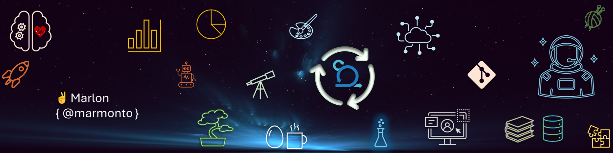

 

``👋 Hello World!``

 

👨‍🚀 I’m Marlon { @marmonto }.

 

Expert Database Administrator + Architect  
Software Engineering   
&emsp;UML, US, Use Cases  
Software Developer:  
&emsp;SQL Developer  
&emsp;ETL Developer  
&emsp;Rusty Software Developer: C# .Net, Java, JavaScript  
&emsp;Shell Programming: PowerShell  

OS Administration  
&emsp;Windows | Linux : Virtualization and Containers  

Automation Fan  

Aspiring DevSecOps - PM  
Team Player and Team Leader  

Agile Scrum Master and DevOps  
CMMI Certified  

  
👁️‍🗨️ read more 💬

  %20trip%20-in%20Tech-0033ba)

   

  

  ⌛ In my beginnings at Tec, C# .Net, Java, JavaScript, T-SQL, and UML made me a Developer.  
   I spent time on requirements, architectures, testing   
    and deep communication between clients and teams to code.   
   I moved to IT, beeing in charge of Windows | Linux Servers, security and networking.  
   I learned a lot, specially in HA-DR with clustering, backup strategies,  
    storage management and virtualization with Hyper-V and VMWare.  
   I soon started as Database Administrator by accident,  
    taking advange of my knowledge from my Dev days.  
   I was able to learn, design, apply, coordinate, monitor, scale, update-upgrade,  
    refactor, and improve database infrastructures for different companies.  
   Combine my knowledge in Dev, Sec, and Ops to build and scale infrastructures.
  

  

  🤯 Each company, project, and team challenged me.   
    I have been able to learn and differentiate myself by having the support of collegues and leaders,  
    projecting myself to become a better engineer, a team player and a team leader.  
  

  

  🔥 I’m interested in:  
    , SLCD, DevSecOps + DataOps / DatabaseOps, CyberSecurity  
    , Data and Database Architecture, Design, Development, Release, and Administration  
    __: Database engines such as SQL Server, PostgreSQL, Oracle, MongoDB, neo4j, redist  
    , Automation: Shell (PowerShell), Pipelines  
    , Azure DevOps - Azure Architecture and Design  
    , Windows/Linux Server, Networking  
  

  

  🧠 I have expanded farther than technical stuff,  
     my curiosity lead me to learn about:  
    , Agile: Scrum + DevOps  
    , CMMI, PMI-PMP,  
    , DAMA  
    , Service Design, Design Thinking, UX/UI  
  

 
 
 

  🕵️ I am currently playing with tools, tecnologies and codes:  
&emsp;&emsp;_ Python for dev and data  
&emsp;&emsp;_ Rust for dev and "hard" coding  
&emsp;&emsp;_ Go for dev and automation  
&emsp;&emsp;_ Flutter for UI/UX  
&emsp;&emsp;_ Practicing Git - GitHub  
&emsp;&emsp;_ Cloud in Azure + Azure DevOps  
&emsp;&emsp;_ Docker, Windows/Linux Server + Virtualization Recap.   
&emsp;&emsp;&  
&emsp;&emsp;_ Human Languages:  
&emsp;&emsp;English, German, French - for literature|poetry, history and cultural access

 
 

&emsp;&emsp;
&emsp;&emsp;

 
 

&emsp;&emsp;

 
 

&emsp;&emsp;

&emsp;&emsp;

 
 

 
 

<!-- https://github.com/Ileriayo/markdown-badges -->

 
 

  🌱 If you find me useful and I can add value to your projects and we can grow together, do not hesitate in contact me.

 

🚀 Yes, not much here yet... just launching.

 

<!-- Not Working: Trying stats about my changes in repos Orgs where I belong -->
<!-- 

-->

<!-- https://github.com/ryo-ma/github-profile-trophy -->

<!-- https://github.com/antonkomarev/github-profile-views-counter -->
<!--  -->

<!--START_SECTION:badges-->
<!--END_SECTION:badges-->
